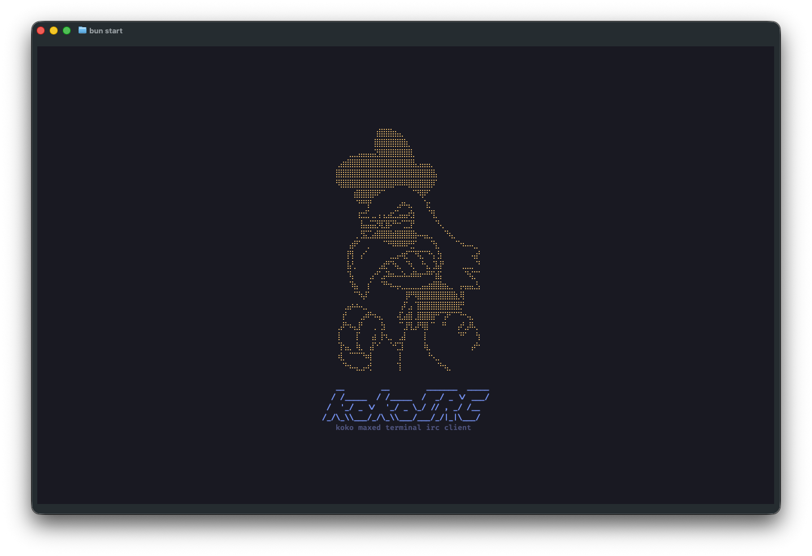
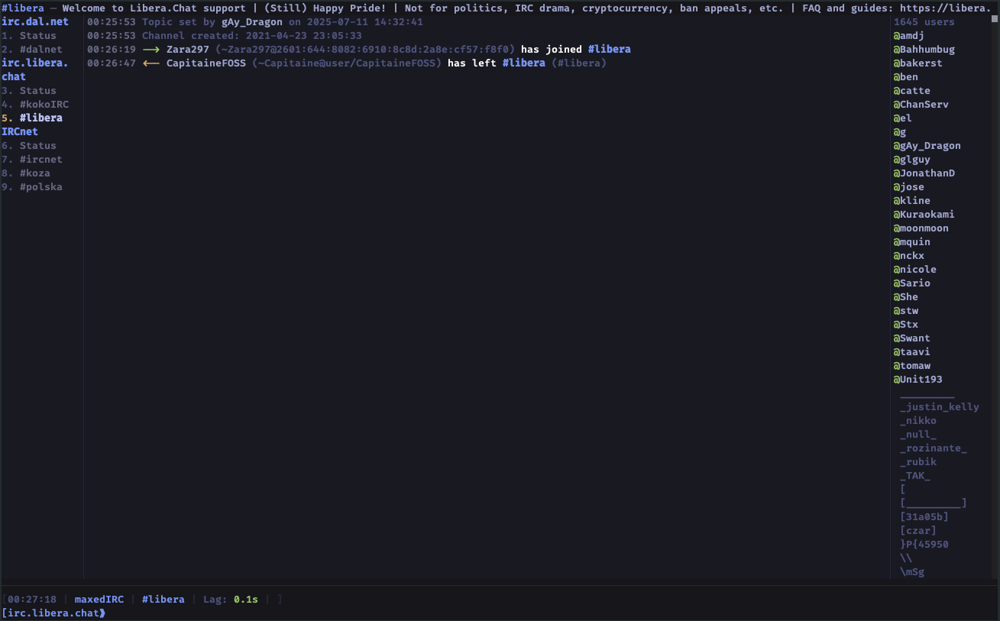
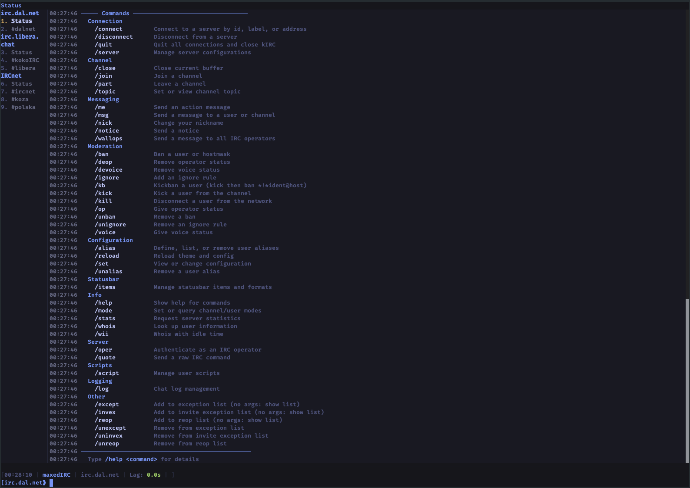
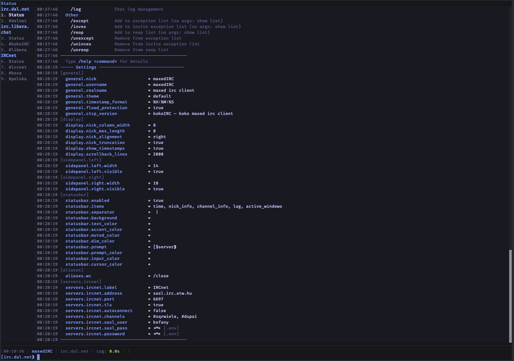

# kokoIRC

A modern terminal IRC client built with [OpenTUI](https://github.com/anomalyco/opentui), React, and Bun. Inspired by irssi, designed for the future.









## Features

- **Full IRC protocol** — channels, queries, CTCP, SASL, TLS, channel modes, ban lists
- **irssi-style navigation** — `Esc+1-9` window switching, `/commands`, aliases
- **Mouse support** — click buffers/nicks, drag to resize sidepanels
- **Netsplit detection** — batches join/part floods into single events
- **Flood protection** — blocks CTCP and nick-change spam from botnets
- **Persistent logging** — SQLite with optional AES-256-GCM encryption, FTS5 full-text search
- **Theming** — irssi-compatible format strings with 24-bit color, custom abstracts
- **Scripting** — TypeScript scripts with event bus, custom commands, IRC access
- **Single binary** — compiles to a standalone executable with `bun build --compile`

## Requirements

- [Bun](https://bun.sh) v1.2+
- A terminal with 256-color or truecolor support

## Install

### From npm

```bash
# Global install (adds `kokoirc` to your PATH)
bun install -g kokoirc

# Then run from anywhere
kokoirc
```

```bash
# Local install (in a project)
bun add kokoirc
bunx kokoirc
```

### From source

```bash
git clone https://github.com/kofany/kokoIRC.git
cd kokoIRC
bun install

# Run directly
bun run start

# Or build a standalone binary
bun run build
./openirc
```

## Configuration

Config lives at `~/.kokoirc/config.toml`. Created on first run with defaults.

```toml
[general]
nick = "mynick"
username = "mynick"
realname = "kokoIRC user"
theme = "default"
flood_protection = true

[display]
nick_column_width = 8
scrollback_lines = 2000

[servers.libera]
label = "Libera"
address = "irc.libera.chat"
port = 6697
tls = true
autoconnect = true
channels = ["#kokoirc", "#secret mykey"]   # "channel key" syntax for keyed channels
autosendcmd = "MSG NickServ identify pass; WAIT 2000; MODE $N +i"
# sasl_user = "mynick"
# sasl_pass = "hunter2"

[logging]
enabled = true
encrypt = false       # AES-256-GCM (key auto-generated in ~/.kokoirc/.env)
retention_days = 0    # 0 = keep forever
exclude_types = []    # filter: "event", "notice", "ctcp", etc.

[aliases]
wc = "/close"
j = "/join"
```

## Commands

38 built-in commands. Type `/help` for the full list, `/help <command>` for details.

| Category | Commands |
|----------|----------|
| Connection | `/connect`, `/disconnect`, `/quit`, `/server` |
| Channel | `/join`, `/part`, `/close`, `/topic`, `/list` |
| Messaging | `/msg`, `/me`, `/notice`, `/action`, `/slap`, `/wallops` |
| Moderation | `/kick`, `/ban`, `/unban`, `/kb`, `/kill`, `/mode` |
| Nick/Ops | `/nick`, `/op`, `/deop`, `/voice`, `/devoice` |
| User | `/whois`, `/wii`, `/ignore`, `/unignore` |
| Info | `/stats` |
| Server | `/quote` (`/raw`), `/oper` |
| Config | `/set`, `/alias`, `/unalias`, `/reload` |
| Logging | `/log status`, `/log search <query>` |
| Scripts | `/script load`, `/script unload`, `/script list` |

## Keyboard Shortcuts

| Key | Action |
|-----|--------|
| `Esc+1-9` | Switch to window 1-9 |
| `Esc+0` | Switch to window 10 |
| `Esc+Left/Right` | Previous/next window |
| `Page Up/Down` | Scroll chat history |
| `Tab` | Nick completion |
| `Ctrl+Q` | Quit |

## Theming

Themes use TOML with an irssi-inspired format string language. Place custom themes in `~/.kokoirc/themes/` and set `theme = "mytheme"` in config.

```toml
[meta]
name = "Nightfall"
description = "Modern dark theme with subtle accents"

[colors]
accent = "#7aa2f7"
fg = "#a9b1d6"

[abstracts]
timestamp = "%Z6e738d$*%N"
msgnick = "%Z565f89$0$1%Z7aa2f7>%N%| "
action = "%Ze0af68* $*%N"

[formats.messages]
pubmsg = "{msgnick $2 $0}$1"
action = "{action $0} $1"
```

Format codes: `%r` red, `%g` green, `%ZRRGGBB` hex color, `%_` bold, `%u` underline, `$0 $1 $2` positional args, `{abstract $args}` template references.

## Scripting

Scripts are TypeScript files loaded from `~/.kokoirc/scripts/`. See `examples/scripts/` for samples.

```typescript
import type { KokoAPI } from "kokoirc/api"

export default function slap(api: KokoAPI) {
  api.command("slap", ({ args, buffer }) => {
    const target = args[0] ?? "everyone"
    api.irc.action(buffer.connectionId, buffer.name,
      `slaps ${target} around a bit with a large trout`)
  })
}
```

Scripts can register commands, listen to IRC events, send messages, and interact with the store:

```typescript
export default function highlights(api: KokoAPI) {
  api.on("irc.privmsg", (event) => {
    if (event.message.highlight) {
      api.ui.addLocalEvent(event.bufferId,
        `Highlight from ${event.nick}: ${event.text}`)
    }
  })
}
```

Configure autoloading in `config.toml`:

```toml
[scripts]
autoload = ["slap", "spam-filter"]
```

## Logging

Messages are stored in `~/.kokoirc/logs.db` (SQLite WAL mode). The log system supports:

- **Batched writes** — flushes at 50 messages or every second
- **Full-text search** — FTS5 index for instant `/log search` results
- **Optional encryption** — AES-256-GCM per message, key auto-generated
- **Read markers** — per-client unread tracking (ready for web frontend)
- **Retention** — auto-purge messages older than N days

## Architecture

```
src/
├── index.tsx              # Entry point — creates OpenTUI renderer
├── app/
│   └── App.tsx            # Lifecycle: config → storage → theme → connect
├── core/
│   ├── irc/               # IRC client, event binding, middlewares
│   ├── state/             # Zustand store (UI-agnostic)
│   ├── commands/          # Command registry and parser
│   ├── config/            # TOML loader, defaults, merge logic
│   ├── storage/           # SQLite logging, encryption, queries
│   ├── scripts/           # Script loader, API, event bus
│   └── theme/             # Format string parser, theme loader
├── ui/                    # React components (no IRC imports)
│   ├── AppLayout.tsx      # 3-column layout with resizable panels
│   ├── ChatView.tsx       # Message scrollback
│   ├── BufferList.tsx     # Left sidebar
│   ├── NickList.tsx       # Right sidebar
│   ├── CommandInput.tsx   # Input line with prompt
│   └── StatusLine.tsx     # Status bar
└── types/                 # TypeScript definitions
```

The UI layer never imports from `core/irc/` — all communication goes through the Zustand store. This keeps the architecture clean and makes it possible to drive the same store from a web frontend.

## Development

```bash
bun run dev          # Start with --watch (auto-reload on file changes)
bun test             # Run test suite
bun run build        # Compile to standalone binary
```

## License

MIT
